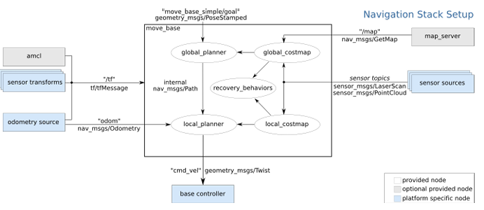

# ROS Noetic course (ETU 2025)

## educational ROS program

### bash
> Организация пространства в `linux`

### launch files
> `launch` - файл с xml разметкой, связывающий несколько узлов. Запускает их одновременно, можно задавать различные параметры запуска, прописывать аргументы и параметры

- `аргументы (arg)` -  тэг, который позволяет задавать входные аргументы launch-файлу
- `параметры (param)` - кастомная настройка узлов программы
- `ноды (node)` -  тэг, указывающий запуск программы

> тэг `<include>` - объявление в теле одного launch файла другого. Проще говоря, автоматический способ задания параметров в главном launch файле

### lidar
> `лидар` - камера на роботе, сканирующая территорию и выдающая информацию как расстояние до препятствий вокруг на плоскости сканирования (<->)

- `rviz` - узел, отображающий информацию из робота (как робот видит окружение)
- `frame` - система координат в rviz (координаты, от которых начинается отчёт по осям)
    - виды фреймов:
        - map
        - base_footprint (z = 0)
        - odom
        - base_scan
        - base_link

### система tf (transorm)
> `tf` - работа с СК в пространстве. Огранизует _transform_-ацию между СК

 > `cтатический TF` (base_footprint -> base_scan) - положение между фреймами не меняются во времени

 > `динамический TF` (odom -> base_footprint) - положение между фреймами может меняться во времени

> инструменты для работы с фреймами

- `rqt_tf_tree` - зависимость между фреймами
- `tf_echo` - численные характеристики TF (СК)

### одометрия
>
- `base_{link/footprint}` - это фрейм, привязанный к движущемуся роботу
- `odom` - фрейм, он показывает положение в пространстве, относительно которого робот движется
- `map` - фрейм, который привязан к фиксированной точке в пространстве, относительно которой движентся робот

> `колёсная одометрия` - это неплохой метод оценить перемещение робота. У нас же есть формула длины окружности? Есть информация о диаметре. По-любому в микроконтроллере подключён энкодер с колёс, который знает, сколько оборотов робот сделал за 20 секунд. Значит можно вычислить пройденный прямо путь
- Например, 3 оборота, длина окружности колеса ~ 0.32 м. Значит, робот проехал 0.96 м

### gmapping
> `gmapping` - это узел, который занимается построением плоской карты препятствий. Алгоритм gmapping работает по принципу "скан достал до препятствия, значит на пути от робота до этой точки нет препятствий"

### навигация роботов
> `навигация` - перемещения из одной точки в другую,
 включая поиск пути. При этом она игнорирует вопросы, связанные с определением положения
 
 - `SLAM` (simultaneous localization and mapping) - одновременная локализация и построение карты. Построение карты в неизвестном пространстве, обновления карты в заранее известном пространстве с одновременным контролем текущего местоположения и пройденного пути
